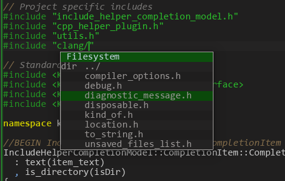



Mini HowTo
==========

This page describe actions to configure the plugin for your project.

Installation
------------

Unpack (or <a data-original-title="$ git clone https://github.com/zaufi/kate-cpp-helper-plugin.git" 
href="#" data-toggle="tooltip" data-placement="top" title="">clone</a>) sources to some workng directory, then execute the following commands from it:

    $ cd <plugin-sources-dir>
    $ mkdir build && cd build
    $ cmake -DNO_DOXY_DOCS=ON -DBUILD_TESTING=OFF -DCMAKE_INSTALL_PREFIX=$(kde4-config --localprefix) ..
    $ make
    $ make install

Configuration
-------------

To enable the plugin for your current session use _Settings -> Configure Kate... -> Plugins_:

Now use plugins' configuration page to ajdust some settings. First of all make sure the _System Paths List_
have a proper directories list used by your compiler (`gcc` by default). Initially, the plugin try to detect
known compilers (gcc and clang) from your path. If current list is not suitable for you, clear it and 
choose appropriate compiler from a list below the page and press _Add to List_.

Support for compilers not in the <code>PATH</code> in my TODO list (for example manually built fresh or crosscompiler gcc).
The <em>Other</em> (disabled now) option has reserved for this purpose.

Add anything else that as you think belongs to all `kate` sessions.

The next page is a _Session Paths List_. Here is a `#include` directories list for your **current session**.
You can store this list into a configuration file for future quick load using _Favorite and Stored Sets_.
By default the plugin provides one predefined set `Qt4` with directories reported by Qt detection script
at plugin compilation time.

Typical dirs you have to add here is the following:
* root of your project's source/build tree and/or any other directories inside your project
* paths to libraries, used in the project, as reported by corresponding configuration tools

The plugin also try to suggest some directories based on opened documents' paths.

Personally I use only two <code>#include</code> directories in all my projects: a source tree root and a build root.
And every source file contains a full path relative to one of listed paths when <code>#include</code> something.
Particularly this technique helps to simplify configuration management when you have to add a bunch of
<code>-I</code> options in your build system configuration files and track inter-component dependencies
all the time you've added a new <code>#include</code> directive in you sources... so finally you've got
a particular compiler command line options the half of your terminal window height :)

The next page allows you to add more compiler options, such as:

* defines found by your build system or required by third party libraries used, so code completer
  will see (and suggest) appropriate declarations
* do not forget to add `-xc++` if you have a C++ project. Also consider to add `-std=c++11` and
  any other options which could affect internal compiler's predefined macros

The plugin is capable to use a _Precompiled Headers_ file. If you have it for your project
is it recommended to specify it in _Session PCH header to compile_ option. Typically this header
consist of `#include` directives for most used header files in your sources. For `cmake` based projects
I have a [module](https://github.com/mutanabbi/chewy-cmake-rep/blob/master/UsePCHFile.cmake) which helps
to make it by command `make update-pch-header`. To use it add `UsePCHFile.cmake`,
`PreparePCHHeader.cmake.in` and `pch_template.h.in` files to your cmake modules directory of your project 
and in a top level `CMakeLists.txt` call it like this:

include(UsePCHFile)
use_pch_file(
    PCH_FILE ${CMAKE_BINARY_DIR}/my-project-pch.hh
    EXCLUDE_DIRS cmake docs
  )

Then you may add this file to _CLang Settings_ page and plugin will build it and use while code completion.

The mentioned CMake module actually is a part of a 
<a href="https://github.com/mutanabbi/chewy-cmake-rep" target="_blank" class="alert-link">
collection of reusable modules</a> under control of 
<a href="https://github.com/mutanabbi/chewy" target="_blank" class="alert-link">
chewy utility</a>. To install it using <code>chewy</code>:
<pre>
$ chewy install https://raw.github.com/mutanabbi/chewy-cmake-rep/master/UsePCHFile.cmake
 * Receiving the module file https://raw.github.com/mutanabbi/chewy-cmake-rep/master/UsePCHFile.cmake
 * Receiving the addon file https://raw.github.com/mutanabbi/chewy-cmake-rep/master/PreparePCHHeader.cmake.in
 * Receiving the addon file https://raw.github.com/mutanabbi/chewy-cmake-rep/master/pch_template.h.in
</pre>
any required additional files will be installed automatically.

The next configuration page of the plugin allows you to fine tune completion results.

<em>Automatic code completion</em> option nowadays is a quite stupid: it tries a completion 
after user enters <em>'.'</em> or <em>'->'</em> in a source code. But more important that it can annoy on
a heavy project (with <a href="http://boost.org" target="_blank">Boost</a> library for example).

The most important thing on this page is a set of regular expressions that can be used to filter
completion results. For example, Boost Preprocessor library define a lot of internal symbols which are
not a part of public API (same for some other libraries from Boost). Also unlikely you want to see
various `#incldue` guards... Using completion results sanitizer you may enter a regex like below
to filter them out:

    BOOST_(PP_[A-Z_]+_(\d+|[A-Z])|.*_HPP(_INCLUDED)?$|[A-Z_]+_(AUX|DETAIL)_)

Leaving a replacement part empty instruct the code completer to remove matched completions. Another practical
example of usage of sanitizer is to beautify some verbose names and to make them litle shorter. For example
the completer may contain items with `std::basic_string<char>`, which is well known as `std::string`, so to make
a particular completion result slightly shorter I use the regex like on a screen shot...

    <ul class="nav nav-tabs">
        <li class="active"><a data-toggle="tab" href="#no-sanitizer">Without sanitizer</a></li>
        <li><a data-toggle="tab" href="#sanitizer">With sanitizer</a></li>
    </ul>
    

        

            
        

        

            
        

    

The _Other Settings_ page contains options related to `#include` directives and a code completer.
The plugin has action (default key is `Shift+F10`) to copy `#include` statement with current file
into a clipboard, so you may switch a document and just paste it. The first option in a 
_`#include` Helper Options_ group specify the format of that preprocessor directive.

At the end of this group you may find a list of file extensions (not a wildcards!) to exclude from 
`#include` completion list.

Based on your system and session directories lists the plugin may highlight `#include` directives
in a source file with an error or warning background. The first one can occur then a file specified is
not found. That means you have to add some more paths to the system/session list. In case of multiple
files found (same name, but different paths) background turned to a warning. In that case it depends
on `-I` compiler options order which one will be actually processed.

The plugin may monitor configured `#incldue` directories, so then a missed file will appear
(after required package being installed or files generated in a build directory), it will remove an 
error mark. One may specify that to monitor in the middle options group.

Monitoring too much (nested) directories, for example in <code>/usr/include</code> configured as
system directory, may lead to high resources consumption, so <code>inotify_add_watch</code> would
return a <code>ENOSPC</code> error (use<code>strace</code> to find out and/or check kate's console log for
<strong>strange</strong> messages from <code>DirWatch</code>).

So if your system short of resources (memory) just try to avoid live <code>#include</code> files 
status updates. Otherwise one may increase a number of available files/dirs watches by doing this:

<pre>
# echo 16384 >/proc/sys/fs/inotify/max_user_watches
</pre>

To make it permanent add the following to <code>/etc/sysctl.conf</code> or 
<code>/etc/sysctl.d/inotify.conf</code> (depending on system):

<pre>
fs.inotify.max_user_watches = 16384
</pre>

To open a header file just move cursor on a line containing `#include` and press `F10` key.
If no valid directive recognized on a current line, a dialog with a list of currently included files will appear.
If you have no write permission to opened file (most likely files from `/usr/include`) read-only
mode will be applied automatically.

<h4>Open Header/Implementation Motivation</h4>

<code>kate</code> shipped with a plugin named <em>Open Header</em>, but sooner after I started to use it I've found
few cases when it can't helps me. Nowadays I have 2 "real life" <del>really annoying</del> examples when it fails:

<ul>
<li>
Often one may find a source tree with separate <code>${project}/src/</code> and <code>${project}/include</code> dirs.
So, when you are at some header from <code>include/</code> dir, that plugin obviously never will find 
your source file. And vise versa.
</li>

<li>
The second case: sometimes I have a really big class defined in a header file
(let it be <code>my_huge_application.hh</code>). It may consist of few dickers of methods each of which is
hundred lines or so. In that case I prefer to split implementation into several files and name them
after a base header like <code>my_huge_application_cmd_line.cc</code> (for everything related to command 
line parsing), <code>my_huge_application_networking.cc</code> (for everything related to network I/O), 
and so on. As you may guess <em>Open Header</em> plugin will fail to find a corresponding header for that
source files.
</li>
</ul>

Last settings group on _Other Settings_ page allow you to tune _Open Header/Implementation_ behaviour.
It is a good practice to have the very first `#include` directive in a `.cc`/`.cpp` file to be a corresponding
header. So, checking the first option in that group will add it to a list of candidates when you press `F11` key.

The second option (_Use wildcard source files search_) aimed to solve the second "real life" problem:
being in a header file and pressing `F11` it appends all `.cc`/`.cpp` files started w/ a current header name
to a list of candidates.

**That is all!** (briefly ;-)

One more thing I have to mention: typing <code>#in</code> in C++ sources will automatically insert <code>#include</code>
text and starts file completer...

Indexing Source Code
====================

Since version 1.0 _Kate C++ Helper_ plugin has indexing feature. One may configure indexed collections via
_Indexer Settings_ in the tool view.

After adding a new index and some targets to be indexed, it is ready to rebuild.

<h4>Note that...</h4>
when build, current compiler options, configured for a session will be used. Diagnostic tab will contain
indexing progress details. In case of too many errors, consider to fix compiler options (like add some missed 
<code>-I</code> options for third party libraries).

After index has built you can use it from any other session despite of any options.

After rebuilding completed and collection available for search, one may use search tab to find something.
There are few _special terms_ (filters) can be passed to the search engine. Generic format of them is:

        keyword:value

_value_ can be a boolean, string or numeric type. In fact only one (true) value needed for boolean type, 
so as a _value_ only _"y"_ is accepted. For example to find virtual functions just add _"virtual:y"_ filter, 
otherwise (if no filter specified) all kinds of symbols will be found.

* `access:public|protected|private` filter by visibility inside the class scope
* `anon:y` or `anonymous:y` should a symbol be in some anonymous scope (namespace, struct, union)
* `base:<class-name>` to find a symbols (classes or structures) inherited from the specified class/struct.  

        base:QAbastractItemModel
        base:basic_ios
* `inheritance:public|protected|private` every kind of inheritance could be prefixed with `virtual-`.
   The short form of this filter is `inh`. Example, to find classes virtually inherited from the `basic_ios`:

        inh:virtual-public base:basic_ios
* `decl:<name>` or `ref:<name>` filters to lookup only declarations or references (usage) of the specified _name_
* `def:y` sometimes declaration and definition could be in different places (lexical containers). This 
    boolean filter allows to find that cases.
* `kind:<value>` filter symbols of specified _kind_, where _value_ can be of one of the following:
    `ns`, `ns-alias`, `typedef`, `type-alias`, `struct`, `class`, `union`, `enum`, `enum-const`, `fn`,
    `method`, `ctor`, `dtor`, `conversion`, `param`, `var`, `field`, `bitfield`
* `pod:y` show only <abbr title="Plain Old Data structures">POD</abbr>s
* `scope:<name>` restrict search only withing given scope. _name_ paramater could be a name (possible 
    fully qualified) of a namespace, class, struct, union, or enum. For example to get all public typedefs
    of `std::basic_string`:

        access:public scope:std::basic_string kind:typedef
* `static:y` show only static data or function members.
* `template:y|ps|fs` show only template symbols, which can be a _partial specialization_ (`ps` value),
    _full specialization_ (`fs` value) or just a template (`y` value).
* `virtual:y` show only virtual function members (i.e. declared w/ a `virtual` keyword)
* `arity:M..N` restrict search for functions (including member functions, constructors or conversion functions)
    with arity in a given range `[M,N]`
* `align:M..N`, `size:M..N` restrict search for types with `alignof()` or `sizeof()` limited by the range `[M,N]`
* `line:M..N`, `column:M..N` restrict search for symbols in a specified range of lines/columns

Search terms can be combined into a logical expressions with the following keywords: `AND`, `OR`, `NOT`, `XOR`
and/or parentheses.

Everything else considered as search terms (symbol names). Wildcards are supported.

Enjoy searching! :-)

See Also
========

* [latest release](http://kde-apps.org/content/show.php?content=148606)
* [sources repository](https://github.com/zaufi/kate-cpp-helper-plugin)
* [ChangeLog](https://github.com/zaufi/kate-cpp-helper-plugin/blob/master/Changes.md)
