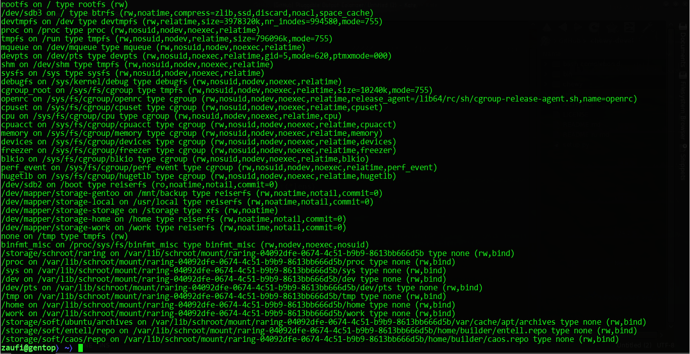
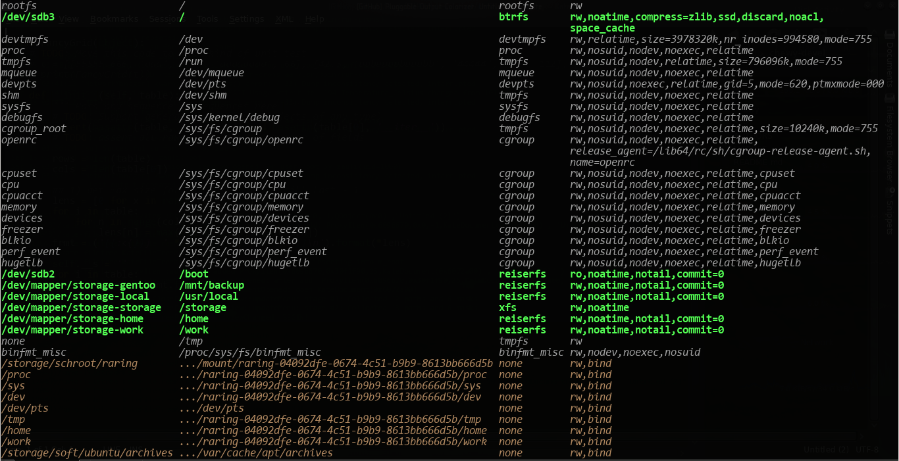



What is This?
=============

_Pluggable Output Processor_ is an engine to wrap any executabe and capture its output through
a pluggable module to colorize it and/or (re)format.

Motivation
==========

_Pluggable Output Processor_ is my attempt to get rid of a bunch of various colorizers
from my system (like `colorgcc`, `colordiff`, `colorsvn`, ...) <del>and take everything under control</del> ;-).
Some of them are written on Perl (and I'm not a fun of it :-) and after few hacks I've made to improve
`colorgcc`, I realized that I don't want to <del>waste my time</del> learning Perl.

Yes, I know there is a lot of stuff like this, but I have few problems w/ it:

1. I'm not a Perl programmer (and don't want to be), but I feel a permanent desire to improve that
  programs in a different ways.
2. Some of that stuff is actually abandoned -- i.e. even if I can fix or improve smth, there is nobody I can send
  my patch to...
3. Some of that stuff is <del>too much</del> _end-user oriented_ <del>so inflexible</del> -- they can colorize
  almost everything via regular expressions and configuration files. The only problem I have w/ them:
  some things I'd like to colorize (or fix formatting) is impossible or **damn hard to express via regexes** ... 
  particularly because line-by-line processing implemented in that tools have no _state_... 
  Yep, I understand that, it will be hard to code, and even harder to use such a tool for end users 
  (i.e. ppl w/o programming skills) -- it is why authors took the easy way: allow user to write regexes in configs.

Features
========

* easy (to Python programmers ;-) to extend
* 256 color terminal support ;-) configuration files in addition to standard named colors
  may contain color definitions as `rgb(r,g,b)` or `gray(n)`
* colorizers for `make`, `cmake`, `gcc` out of the box (more plugins to come ;-)
* some modules are not just a stupid colorizers ;-) For example `gcc` can reformat text for
  better readability (really helps to understand template errors). Also `cmake` module can reduce
  amount of lines printed during test by collapsing test _intro_ message and _result_ into a single one.

Installation
============

Easy!

    $ pip install outproc

or

    $ tar -xzf outproc-X.Y.tar.gz
    $ cd outproc-X.Y
    $ sudo easy_install .

For Gentoo users there is a [live ebuild](https://github.com/zaufi/zaufi-overlay/blob/master/dev-util/pluggable-output-processor/pluggable-output-processor-scm.ebuild)
in my [repository](https://github.com/zaufi/zaufi-overlay/). 
Also (for Gentoo users again ;-) `eselect` module from `contrib/` will be installed by the ebuild. 
Users of other distros have to make a symlinks to required modules manually:

    $ ln -s /usr/bin/outproc /usr/lib/outproc/bin/<module-name>

and then make sure `/usr/lib/outproc/bin` placed __before__ `/usr/bin` (and anything else) in your 
user/system `PATH` environment. Available modules (plugins) can be found at `<python-site-packages-dir>/outproc/pp`.
For example, to install the `gcc` module do the following:

    $ ln -s /usr/bin/outproc /usr/lib/outproc/bin/gcc

Then you may edit `/etc/outproc/gcc.conf` to adjust color settings. 

Usage Examples
==============

CMake
-----

CMake module can recognize (and colorize) various detection <del>SPAM</del> info during test phase.
Also it will reduce a little lines count to be printed by one trick: if a previous line (remembered
internally after print) is a subset of the current one, just move one line above and print over it...

    <ul class="nav nav-tabs">
        <li class="active"><a data-toggle="tab" href="#cmake-before">Before</a></li>
        <li><a data-toggle="tab" href="#cmake-after">After</a></li>
    </ul>
    

        

            
        

        

            
        

    

GNU make
--------

This module can colorize _error_ and _service messages_ from `make` (like _entering/leaving_ directory).
Also it can recognize some "information" messages from `cmake` and/or `gcc` command line (when `make VERBOSE=1` 
used to build) -- i.e. it works for cmake-based projects (my favorite build utility nowadays).

    <ul class="nav nav-tabs">
        <li class="active"><a data-toggle="tab" href="#make-before">Before</a></li>
        <li><a data-toggle="tab" href="#make-after">After</a></li>
    </ul>
    

        

            
        

        

            
        

    

GNU gcc
--------

This module is capable to colorize errors, warnings, C++ code snippets (best viewed w/ 256 color terminals ;-)
and reformat/simplify some loooong error messages...

    <ul class="nav nav-tabs">
        <li class="active"><a data-toggle="tab" href="#gcc-before">Before</a></li>
        <li><a data-toggle="tab" href="#gcc-after">After</a></li>
    </ul>
    

        

            
        

        

            
        

    

mount
-----

Mount plugin can format columns into a table. Also it can colorize filesystems by types:
* _kernel_ -- i.e. service filesystems like `cgroup`, `mqueue`, `devpts` & etc
* _real_ -- i.e. a real devices was mounted
* _rebind_ -- i.e. filesystems w/ `bind` option

    <ul class="nav nav-tabs">
        <li class="active"><a data-toggle="tab" href="#mount-before">Before</a></li>
        <li><a data-toggle="tab" href="#mount-after">After</a></li>
    </ul>
    

        

            
        

        

            
        

    

Configuration Details
=====================

Here is mine `/etc/outproc/gcc.conf` for example:

    # Settings for GNU gcc output processor

    # Message colors by severity level
    error = rgb(5,1,1)
    warning = rgb(4,2,0)
    notice = normal

    # Source file and position
    location = gray(8)+itallic

    # Code snippet colors
    code = white
    code-keyword = rgb(4,5,0)+bold
    code-builtin-type = rgb(5,1,0)
    code-modifier = rgb(4,3,0)
    code-std-namespace = rgb(2,5,0)
    code-boost-namespace = rgb(0,2,1)
    code-data-member = normal
    code-preprocessor = green
    code-numeric-literal = rgb(0,2,4)
    code-string-literal = magenta+itallic
    code-comment = rgb(2,2,1)+itallic
    code-cursor = rgb(2,0,0)

    # Add a new line after source code snippet
    # NOTE The `gcc` module will remove lines w/ error position indicator ('^')
    # (error position will be indicated in a source line w/ a background color
    # specified by `code-cursor` color). As a result error messages become
    # slightly condensed ;-) -- So this setting allow you to control whether
    # a new line will be added instead of line w/ error position indicator.
    new-line-after-code = false

// TBD

How to Extend
=============

To add a new module you have to name it after a tool you want to wrap (process output from) +
`.py` extension and put that module into `${python-site-packages-dir}/outproc/pp/` dir.
Then make a symlink from `/usr/bin/outproc` to `/usr/lib/outproc/bin/<wrapped-executable>` or 
use `eselect` in Gentoo. Being executed `outproc` will realize (from the symlink name) what binary
to execute and capture output from. All captured lines will be _piped_ through `your-module.Processor.handle_line()`.

A minimal plugin code will looks like this:


#!/usr/bin/env python
# -*- coding: utf-8 -*-

import outproc

class Processor(outproc.Processor):

    def __init__(self, config, binary):
        super().__init__(config, binary)
        # If you want some parameters from `/etc/outproc/<your-module>.conf
        # use `self.config` to get them...

    def handle_line(self, line):
        '''
            Handle one line from a wrapped executable
        '''
        # TODO transfrom the line and return it back...
        return line



Actually a plugin may control few more things like:

* what configuration file to use
* is it want to handle an output for particular command (analyzing command line options)
  or the engine should just `exec()` a wrapped command
* it also may want to handle a whole block of output text instead of line-by-line

More details are coming...

TODO
====

* <del>continue to improve C++ tokenizer</del>   
  now it is capable to handle almost everything I wanted to implement. Just one thing remain: 
  reformat too long template names into a smth shorter than terminal width...
* 
<del>unit tests for tokenizer</del>

* test files w/ to cause various error messages from gcc (+ unit test for colorizer somehow)
* continue to improve `cmake` support (+ unit tests)
* 
<del>turn <code>mount</code> output into a human readable look-n-feel</del>

* colorize `df` depending on free space threshold
* colorize `diff` (easy! :-)
* 
<del><code>eselect</code> module to manage tools under control</del>

* 
<del>ask module is it want to handle a current command or we can do <code>execv</code> instead</del>

* implement `STDIN` reader (pipe mode)
* handle `KeyboardInterrupt` and hide Python crap
* `ctest` module to colorize test results

See Also
========

* [latest release](http://cli-apps.org/content/show.php?content=160833)
* [sources repository](https://github.com/zaufi/pluggable-output-processor)

